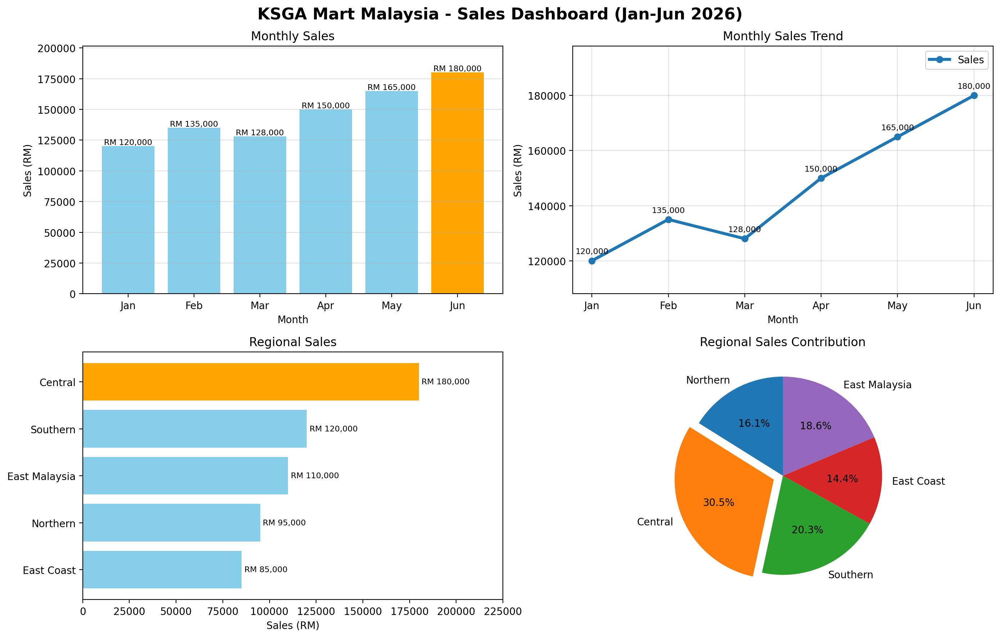

# Python Data Visualization with Matplotlib

> Sales performance analysis for **KSGA Mart Malaysia** (Jan–Jun 2026), built during a Python data visualization workshop at KSwamy Global Academy.



## Overview

Welcome to my GitHub repository. This repository is the outcome of my learning journey through a Python data visualization workshop, where I practiced and consolidated key charting concepts using Matplotlib and pandas. It takes learners from beginner concepts, such as simple bar and line charts, to more advanced topics like combined charts, annotations, multi-panel dashboards and business interpretation. I built it not only to reinforce what I learned but also to share useful resources with others who want a clear, hands-on way to strengthen their Python visualization skills.

## The Scenario

I played the role of a Data Analyst at KSGA Mart Malaysia. Management asked for an analysis of sales performance for the first six months of 2026, presented through Python visualizations.

## What's Inside

| # | Activity | Chart type | Output |
|---|----------|-----------|--------|
| 1 | Monthly Sales | Bar chart, value labels, highest month highlighted | `01_monthly_sales_bar.png` |
| 2 | Sales Trend | Line chart, markers, data labels, grid, legend | `02_sales_trend_line.png` |
| 3 | Sales vs Expenses | Multi-line chart, annotated largest gap | `03_sales_vs_expenses.png` |
| 4 | Regional Sales | Horizontal bar, sorted, top region highlighted | `04_regional_sales_barh.png` |
| 5 | Profit Analysis | Bar + line combo with value labels | `05_profit_bar_line.png` |
| 6 | Customer Growth | Line chart with data labels | `06_customer_growth.png` |
| 7 | Sales Contribution | Pie chart, percentages, exploded largest slice | `07_region_pie.png` |
| 8 & 9 | Dashboard | 2×2 subplot figure | `ABC_Mart_Dashboard.png` |
| 10 | Business Insights | Written analysis | [`docs/business_insights.md`](docs/business_insights.md) |

I also practiced loading data from CSV files with pandas (`src/csv_visualizations.py`).

## Repository Structure

```
python-data-visualization/
├── README.md
├── LICENSE
├── requirements.txt
├── .gitignore
├── data/
│   ├── sales_data.csv
│   ├── product_sales.csv
│   └── employee_salary.csv
├── src/
│   ├── ksga_mart_dashboard.py     # Activities 1-9
│   └── csv_visualizations.py      # pandas + CSV practice charts
├── docs/
│   └── business_insights.md       # Activity 10
└── outputs/                       # generated charts
```

## Getting Started

```bash
git clone https://github.com/termizilatif/python-data-visualization.git
cd python-data-visualization
pip install -r requirements.txt

python src/ksga_mart_dashboard.py        # saves all charts to outputs/
python src/ksga_mart_dashboard.py --show # also opens the chart windows
python src/csv_visualizations.py         # CSV-based charts
```

## Key Findings

- **June** was the best month: RM 180,000 in sales, up **50%** from January.
- **Central** is the top region with **30.5%** of regional sales.
- Profit grew **123%** (RM 35k → RM 78k) as expenses grew only 20%.
- Profit margin improved from **29.2%** to **43.3%**.
- **April** saw the largest customer jump (+200, +16%).

See [`docs/business_insights.md`](docs/business_insights.md) for the full analysis and recommendations.

## Skills Practiced

Bar charts · Line charts · Horizontal bar charts · Pie charts · Data labels · Markers · Legends · Gridlines · Annotations · Chart customization · Subplots and dashboards · Reading CSVs with pandas · Business interpretation

## Tech Stack

Python 3.9+ · Matplotlib · pandas

## License

This project is licensed under the MIT License. See [LICENSE](LICENSE) for details.

## Acknowledgements

Scenario and exercises from **KSwamy Global Academy**. Code and analysis written by me as part of my learning.
